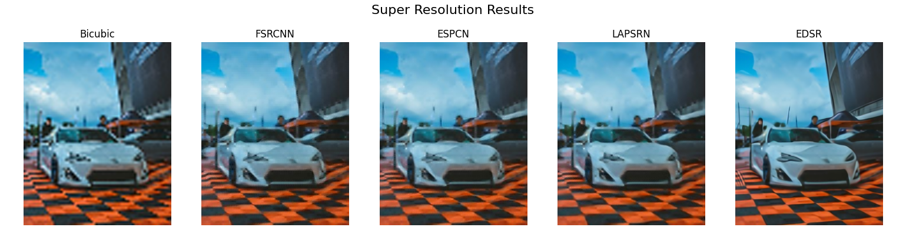
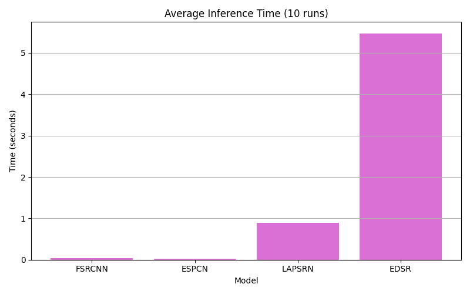
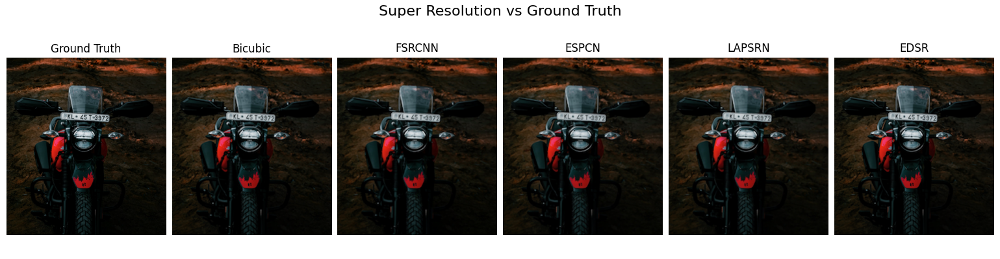

# 🌟 Super-Resolution Showcase


[](https://www.python.org/)
[](https://opencv.org/)
[](../LICENSE)

[](https://github.com/HeleenaRobert)

A visual benchmark of four deep learning models for Single Image Super-Resolution (SISR) using OpenCV's DNN module. This project compares model quality, runtime, and scale factors in a clear, reproducible format.

---

## 🔍 Overview

This project demonstrates the effectiveness of:

- **EDSR**
- **ESPCN**
- **FSRCNN**
- **LapSRN**

Each model is tested at 4× upscaling. Output comparisons help you evaluate both **visual clarity** and **performance runtime**.

> 💡 While all scale models (`x2`, `x3`, `x4`) are included in the `models/` folder for reference, the demo scripts use only `x4` models for consistency.  
> 🔸 **LapSRN** does not support `x3`, but includes a unique `x8` model.

---

## 🚀 Key Features

- 🔧 Easy-to-use demos for all 4 models  
- 📊 Runtime comparison for each model  
- 🖼️ Side-by-side visual quality output  
- 🗂️ Modular, reusable utils structure

---

## 🧠 How It Works

1. Load the super-resolution model using OpenCV’s DNN module  
2. Upscale a given low-resolution input  
3. Compare results visually and numerically  
4. Save all outputs in the `assets/` folder

---

## 📂 Folder Structure

```bash
super-resolution-showcase/
│
├── assets/                           # Output, runtime and quality samples, banner
│   ├── quality_comparison.png
│   ├── runtime_chart.png
│   ├── model_output.png
│   └── banner.png
│
├── input/                            # Low-res input images
│   ├── bike-200.png
│   ├── car-low.jpg
│   ├── kitten-200.png
│   └── path-low.jpg
│ 
├── output/                           # All program output images are saved here
│
├── ground_truth/                     # High-res originals for quality reference
│   ├── bike-800.png
│   ├── car-high.jpg
│   └── path-high.jpg
│ 
├── models/                           # Pre-trained model files (.pb)
│   ├── edsr/    
│   │   ├── EDSR_x2.pb
│   │   ├── EDSR_x3.pb
│   │   └── EDSR_x4.pb
│   │ 
│   ├── espcn/    
│   │   ├── ESPCN_x2.pb
│   │   ├── ESPCN_x3.pb
│   │   └── ESPCN_x4.pb
│   │ 
│   ├── fsrcnn/  
│   │   ├── FSRCNN_x2.pb
│   │   ├── FSRCNN_x3.pb
│   │   └── FSRCNN_x4.pb
│   │ 
│   └── lapsrn/   
│       ├── LapSRN_x2.pb
│       ├── LapSRN_x4.pb
│       └── LapSRN_x8.pb
│
├── utils/
│   ├── visualizer.py
│   └── superres_utils.py            # Core model loader and inference logic
│
├── demo_all_models.py               # Run all models on sample inputs
├── compare_runtime.py               # Time performance of each model
├── compare_quality.py               # Save visual outputs for comparison
│ 
├── requirements.txt
├── .gitignore
├── LICENSE
└── README.md
```

---

## 🧪 Demo Scripts

Run all models:

```bash
python demo_all_models.py
```

Compare runtime:

```bash
python compare_runtime.py
```

Compare visual outputs:

```bash
python compare_quality.py
```

📁 All outputs are saved inside the `output/` folder.

---

## 🖼️ Sample Output Gallery

⚡ Super resolution model output



📊 Runtime comparison



🖼️ visual analysis



---

## 📦 Requirements

Install required libraries:

```bash
pip install -r requirements.txt
```

---

## 🪪 License

This project is open-source under the [MIT License](LICENSE)

---

## 🙋‍♀️ Author

**Heleena Robert**  
[GitHub](https://github.com/HeleenaRobert)
